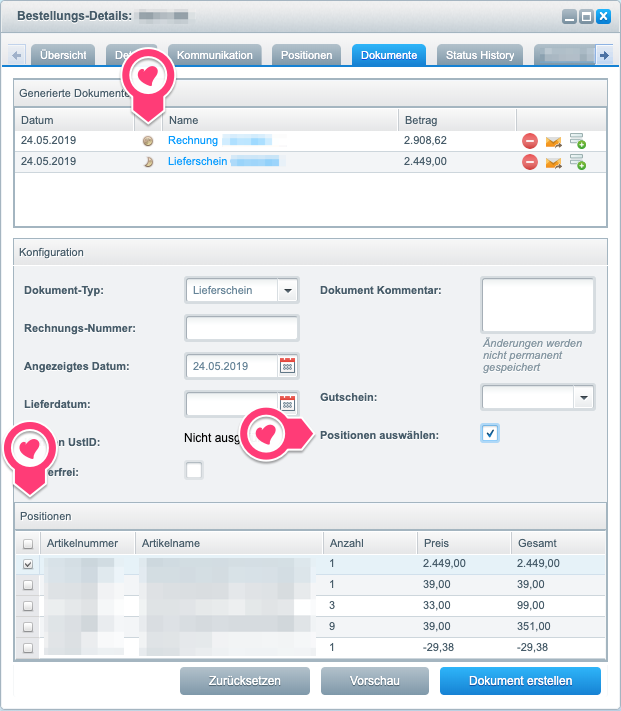
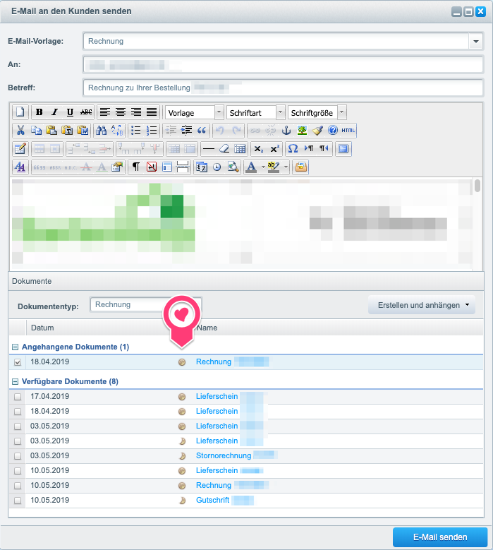
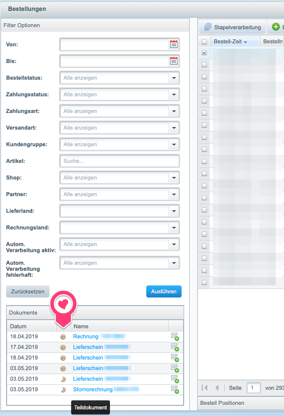
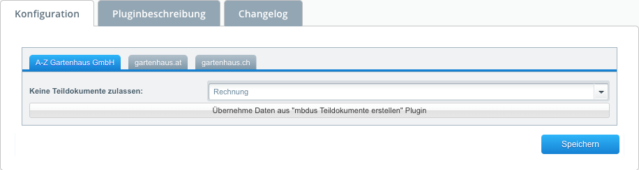
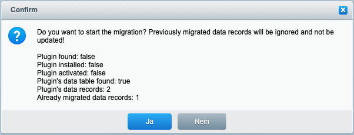
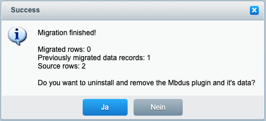

# BucoPartDocuments
Shopware plugin to create order documents for just a subset of positions of an order.

## Features
This plugin adds the ability to create an order document with just a subset
of the order's positions. Therefore, the order's document tab has a new checkbox
to enable the selection. Once selected, a new position grid becomes available to select the
desired positions. With no positions selected, an emtpy document will be created. This might
be useful, to place messages via the document's comment field.



To indicate whether the document is a part document or a regular ("full") document, a moon and
half moon icon will be introduced in several places like the document tab, the document quick
overview and the mail window.





Sending a document via e-mail will extend the mail context with a `$EventResult.bucoIsPartDocument`
boolean variable, indicating the state of the attached document. So it's possible to render different
outputs depending on the state of the document. E.g.:

```smarty
{if $EventResult.bucoIsPartDocument}
    The attached document contains a subset of positions.
{else}
    The attached document contains a all positions.
{/if}
```

This variable is set, if the mail has ONE attachment only. With multiple attachments, the variable
would lose it's meaning.

### Configuration

It's possible to restrict the creation of part documents to specific document types or templates.



### Migration
If you were using the [mbdus Teildokumente erstellen](https://store.shopware.com/mbdus41476730029/teildokumente-erstellen.html) plugin before,
there is a migration assistant for you. This will migrate the mbdus part documents into this plugin.
Please beware, that this plugin has less features than the mbdus plugin. E.g. it's not possible to
change the recipients postal address. On the other hand, this implementation is much leaner and
less error-prone.





The internal database IDs will be re-enumerated. The original primary key will be preserved in the
`s_order_documents_attributes.buco_part_document_legacy_id` column for your service.

The access to the migration assistant is protected with an ACL resource. The `local_admin` user role
is enabled by default. Otherwise, you might wish to grant other roles access to the `bucopartdocumentsmigration.migrate` privilege.

The mbdus plugin doesn't need to be installed anymore. After the uninstallation, the plugin left it's data tables behind.
This left-behinds are sufficient to do the migration. You'll have possibility to clean up these tables at the end of the migration process.

### Programmatically Usage
If you need to create a part document programmatically, please pass the following arguments to the
`initDocument()` method. Yes, some of the information are redundant. This is based on technical
restrictions. Please refer to the source code for further details. A [pull request (shopware/shopware#2121)](https://github.com/shopware/shopware/pull/2121) is pending,
to address this issues.

```php
\Shopware_Components_Document::initDocument($orderId, $docTypeId, [
    'netto' => false,
    'shippingCostsAsPosition' => true,
    '_renderer' => 'pdf',
    'bucoCreatePartDocument' => true,       // used to create part document
    'bucoPartDocPosIds' => [1,2],           // used to create part document; not an index, but the s_order_details primary key
    '_allowMultipleDocuments' => true,      // used to create part document
    'attributes' => [
        'bucoIsPartDocument' => true        // used to create part document
    ],
    'summaryNet' => [
        'bucoCreatePartDocument' => true,   // used to create part document
        'bucoPartDocPosIds' => [1,2]        // used to create part document; not an index, but the s_order_details primary key
    ]
]);
```

## Compatibility
* Shopware >= 5.5.0
* PHP >= 7.0
* Migration from [mbdus Teildokumente erstellen](https://store.shopware.com/mbdus41476730029/teildokumente-erstellen.html) plugin

## Installation

### Git Version
* Checkout plugin in `/custom/plugins/BucoPartDocuments`
* Install and active plugin with the Plugin Manager

### Install with composer
* Change to your root installation of Shopware
* Run command `composer require buddha-code/buco-part-documents`
* Install and active plugin with `./bin/console sw:plugin:install --activate BucoPartDocuments`

## Contributing
Feel free to fork and send pull requests!

## Licence
This project uses the [GPLv3 License](LICENCE).